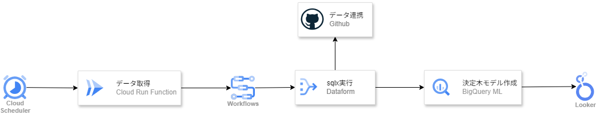

# credit_detect
# クレジットカード不正監視データパイプライン構築

# 1. プロジェクト概要

公開されているクレジットカード取引データセットを活用し、日次のデータ取り込みからデータ加工、機械学習モデルによる不正検知、そしてダッシュボードでの可視化までを一貫して行う自動化パイプラインを構築します。
実運用を想定し、インフラストラクチャはすべてTerraformを用いてコード化（IaC）しています。

# 2. アーキテクチャ



## 構成図 (システムフロー)

1. **Cloud Scheduler** (日次トリガー)
↓
2. **Cloud Run Jobs** (擬似データをBigQueryにインサート)
↓
3. **Workflows** (後続の処理をオーケストレーション)
↓
4. **Dataform** (ETL処理・特徴量エンジニアリング) + **GitHub**連携
↓
5. **BigQuery ML** (機械学習モデルの再学習・推論)
↓
6. **Looker Studio** (ダッシュボード可視化)

## 各コンポーネントの役割と工夫点

- **疑似ストリーミング/バッチ処理 (Cloud Run Jobs)**
元の公開データは2日分のみの静的データですが、実運用に近づけるため、Cloud Run Jobsを用いて元データから擬似的に日次でデータを抽出し、分析用のBigQueryテーブルに追記する仕組みを実装します。これにより、日次バッチが「意味のあるデータ更新」として機能します。
- **Dataformによる特徴量エンジニアリング**
単なるデータコピーではなく、機械学習の精度を上げるためのデータ加工（取引金額の標準化、時間帯（秒）データのカテゴリ化、Null処理など）をDataform上のSQL（.sqlx）として実装し、GitHubでバージョン管理します。
- **Workflowsによる制御**
データ投入から、Dataformの実行、BQMLモデルの更新までの一連の流れを安全に連携させます。

# 3. 使用するデータセットと機械学習モデル

## 使用データセット

- **対象データ:** `bigquery-public-data.ml_datasets.ulb_fraud_detection`
- **ターゲット変数:** `Class` (1: 不正利用、 0: 正常利用)

## データ分割戦略

- 疑似的にインサートされたデータを元に、直近N日分を「学習・検証用」、最新のバッチ取り込み分を「予測・評価用」としてパイプライン内で自動分割します。

## 機械学習モデル

- **アルゴリズム:** 勾配ブースティング木 (`boosted_tree_classifier`)
- 極端な不均衡データ（正常取引が圧倒的多数）であるため、決定木ベースのアンサンブル学習を採用し、パラメータチューニングによる精度向上を図ります。

# 4. ダッシュボード可視化項目 (Looker Studio)

ビジネス層が日々の状況を把握し、かつモデルの精度をモニタリングできるダッシュボードを構築します。

### **A. 運用指標 (最新バッチ結果)**

- クレジットカード総取引数
- 検知された不正利用数
- 不正利用の割合（％）

### **B. モデル評価指標 (不均衡データに特化)**

- **PR-AUC (適合率-再現率曲線の下部面積):** 不正検知において最も重視すべき指標。
- **F1スコア:** 適合率と再現率の調和平均。
- **再現率 (Recall):** 実際の不正のうち、どれだけ検知できたか（見逃しを防ぐ）。
- **適合率 (Precision):** 不正と予測したうち、実際に不正だった割合（誤報を防ぐ）。
- **ROC曲線 / AUC**

### **C. 追加評価指標 (SOP-MLOPS-2026-002)**

算出定義・判定基準・Looker Studio 用テーブルは [EVALUATE.md](EVALUATE.md) を参照。

**① 分布乖離・判別力 (Distribution Separation)**

- KS統計量 (Kolmogorov-Smirnov)
- IV (Information Value) / WoE
- Cliff's Delta (δ)
- 陽性・陰性 Zスコア差 (ΔZ)（参考値）

**② BQML 固有説明性 (Model Explainability)**

- `ML.FEATURE_IMPORTANCE` (Gain)
- `ML.FEATURE_IMPORTANCE` (Cover)
- `ML.GLOBAL_EXPLAIN` (Tree SHAP)
- `ML.EXPLAIN_PREDICT` (Local SHAP)

**③ 予測性能・不均衡適応 (Predictive Performance)**

- PR-AUC (Precision-Recall AUC)
- Top-K% Capture Rate (Recall)
- Cost-Sensitive Expected Loss

**④ 安定性・経時変化 (Model & Data Stability)**

- PSI (Population Stability Index)

# 5. インフラストラクチャとデプロイメント (IaC)

実務レベルのクラウド設計を証明するため、コンソールからの手動作成を廃し、以下のリソースをすべて **Terraform** で定義します。

- **BigQuery**
    
    データセット、テーブルスキーマ
    
- **Cloud Scheduler & Workflows**
    
     ジョブ定義とスケジューリング
    
- **Cloud Run Jobs**
    
    コンテナ実行環境の定義
    
- **Dataform**
    
    リポジトリ連携設定
    
- **IAM / サービスアカウント**
    
     最小特権の原則に基づき、各サービス（Run Jobs, Workflows, Dataform等）が連携するために必要な権限のみを付与したサービスアカウント。
    

リポジトリには `terraform apply` と初期データ投入を一括で行うシェルスクリプトを同梱し、第三者が容易に環境を再現できるようにします。

# 6. 注意事項 (データセット分割による擬似運用について)

本プロジェクトで使用する公開データセット（`ulb_fraud_detection`）は、元々「2日間（48時間）の取引データ」しか含まれていない静的なデータセットです。これを日次運用される実際のデータパイプラインとして機能させるため、本プロジェクトでは意図的に以下の工夫を行っています。

### **レコードスライスによるデータ分割**

元データを50分割し、「50日分のバッチデータ」と見立てて抽出し、50日分の擬似的な日次データとして処理します。

# 7. 事前準備

**① clone → ② 単体テスト → ③ Artifact Registry / イメージ → ④ tfvars → ⑥ PAT シークレット作成 → ⑤ terraform apply（Git 接続込み） → ⑦ `initial_setup` → ⑧ 結合試験**


## 事前に揃えるもの

| 項目 | 内容 |
| --- | --- |
| GCP プロジェクト | 課金有効。リージョンは `asia-northeast1` |
| 権限 | プロジェクト Owner、または Terraform が SA / IAM / BQ / Run / Workflows / Scheduler / Dataform / Secret Manager を作れること |
| WSL | `git`, `python3`, `python3-venv`, `gcloud`, `terraform`（1.5+） |
| GitHub | `credit_detect`（アプリ / IaC）と、Dataform 用の **ルート配置リポジトリ**（例: `credit_detect_dataform`） |
| PAT | Dataform が GitHub HTTPS で読む／書くなら PAT。Secret Manager に入れ、Dataform SA へ `secretAccessor` を付ける |

Dataform は **リポジトリ直下の `definitions/` しかコンパイルしません。** この `credit_detect` の sqlx は `dataform/definitions/` にあるため、Git 連携先を本リポジトリの `main` にすると日次も初回も失敗します。連携先は sqlx をルートに置いた `credit_detect_dataform` 側にしてください。`workflow_settings.yaml` の `defaultProject` も、実プロジェクト（既定は `skir-sample-credit`）と一致させる必要があります。Dataform core 3.0 では `dataform.json` は廃止で、`workflow_settings.yaml` と同時に置くとコンパイルが失敗します。

README にある「terraform apply と初期投入を一括するシェル」は **リポジトリに存在しません。** 手動で進めます。

---

## ① GCP・GitHub 連携済み WSL で clone

```bash
# GitHub
git clone https://github.com/Ysakairi/credit_detect.git
cd credit_detect
git checkout main
git pull origin main

# GCP（未ログインなら）
gcloud auth login
gcloud auth application-default login
gcloud config set project YOUR_PROJECT_ID
gcloud config set compute/region asia-northeast1
gcloud config get-value project
```

`YOUR_PROJECT_ID` は以降すべて同じ値にします。`workflow_settings.yaml` の `defaultProject` も同じ ID である必要があります。

---

## ② Ubuntu 上で単体テスト

GCP は呼びません。Python 3.10 相当を想定します。Ubuntu / WSL では `python` は標準では入っておらず `python3` だけです。`python3 -m venv .venv` のあと `source .venv/bin/activate` すると、venv 内の `python` が使えます。venv 作成に失敗する場合は `sudo apt install python3-venv python3.12-venv python3-full`。

**評価ロジック**

```bash
cd evaluate
python3 -m venv .venv
source .venv/bin/activate
pip install -r requirements.txt
python -m unittest test_evaluate_feature.py -v
deactivate
cd ..
```

**Cloud Run Job 取り込み**

```bash
cd batch_app
python3 -m venv .venv
source .venv/bin/activate
pip install -r requirements.txt
python -m unittest test_daily_insert.py -v
deactivate
cd ..
```

どちらも OK になってからイメージを積んでください。失敗したまま ④ に進むと、壊れたコンテナが Artifact Registry に載ります。

---

## ③ Artifact Registry に Cloud Run Jobs 一式を登録

Terraform は **AR リポジトリを作りません。** Job が参照するイメージ名は次で固定です。

`asia-northeast1-docker.pkg.dev/YOUR_PROJECT_ID/my-repo/daily-ingest:latest`

`YOUR_PROJECT_ID` は ① で `gcloud config set project` した値です。プレースホルダのまま submit しないでください。

コンソール:

1. **API とサービス** で `Artifact Registry API` と `Cloud Build API` を有効化
2. **Artifact Registry → リポジトリを作成**
   - 名前: `my-repo`（変えるなら ⑤ の `repo_docker` も変える）
   - 形式: Docker
   - リージョン: `asia-northeast1`

プッシュは WSL または Cloud Shell から行います。Dockerfile は **`batch_app/`** にあります。リポジトリ直下で `gcloud builds submit` すると失敗します。

2024 年以降、新しいプロジェクトの Cloud Build はレガシーの `@cloudbuild.gserviceaccount.com` ではなく **Compute Engine デフォルト SA**（`PROJECT_NUMBER-compute@developer.gserviceaccount.com`）でビルドします。この SA にソース読み取り権限が無いと、アップロード直後に次で落ちます。

`...-compute@developer.gserviceaccount.com does not have storage.objects.get access to the Google Cloud Storage object`

```bash
PROJECT_ID="$(gcloud config get-value project)"
PROJECT_NUMBER="$(gcloud projects describe "${PROJECT_ID}" --format='value(projectNumber)')"
COMPUTE_SA="${PROJECT_NUMBER}-compute@developer.gserviceaccount.com"

gcloud services enable artifactregistry.googleapis.com cloudbuild.googleapis.com

# Cloud Build 実行 SA（Compute デフォルト）へ、ソース取得・ログ・イメージ push に必要な権限
gcloud projects add-iam-policy-binding "${PROJECT_ID}" \
  --member="serviceAccount:${COMPUTE_SA}" \
  --role="roles/storage.objectViewer"

gcloud projects add-iam-policy-binding "${PROJECT_ID}" \
  --member="serviceAccount:${COMPUTE_SA}" \
  --role="roles/logging.logWriter"

gcloud projects add-iam-policy-binding "${PROJECT_ID}" \
  --member="serviceAccount:${COMPUTE_SA}" \
  --role="roles/artifactregistry.writer"

# コンソールで未作成なら
gcloud artifacts repositories create my-repo \
  --repository-format=docker \
  --location=asia-northeast1 \
  --description="Repository for fraud detection pipeline"

# IAM 反映待ち（直後の submit がまだ 403 なら数十秒置いて再実行）
cd batch_app
gcloud builds submit --tag "asia-northeast1-docker.pkg.dev/${PROJECT_ID}/my-repo/daily-ingest:latest"
cd ..
```

手順 ② で作った `.venv` が `batch_app/` に残っていると、ビルドコンテキストが数百 MB になります。submit 前に消すか、ディレクトリの外へ移してください。`.venv` はイメージに不要です。

確認:

```bash
PROJECT_ID="$(gcloud config get-value project)"
gcloud artifacts docker images list \
  "asia-northeast1-docker.pkg.dev/${PROJECT_ID}/my-repo" \
  --include-tags
```

`daily-ingest:latest` が見えること。同一プロジェクトなら Cloud Run の pull 権限は通常自動付与されます。

---

## ④ プロジェクト情報を登録する（`main.tf` は直接書き換えない）

`project_id` は必須変数で、値は **`terraform.tfvars` に書きます。** `main.tf` の `variable` ブロックを編集する必要はありません。`*.tfvars` は gitignore 済みです。

```bash
cd terraform
cp example.tfvars terraform.tfvars
```

`terraform.tfvars` 例:

```hcl
project_id = "YOUR_PROJECT_ID"
region     = "asia-northeast1"
repo_docker = "my-repo"
```

**Dataform の Git URL / ブランチ / トークン版は `terraform.tfvars` に書かない。** `main.tf` の既定が本番と同じ値です。

| 項目 | 既定（`main.tf`） |
| --- | --- |
| リポジトリ ソース | `https://github.com/Ysakairi/credit_detect_dataform.git` |
| デフォルト ブランチ | `main` |
| シークレット トークン | `projects/<project_id>/secrets/dataform-github-token/versions/latest` |

`<project_id>` は上の `project_id` から入ります。`credit_detect` 本体は validation で拒否されます。上書きが必要なときだけ `dataform_git_url` / `dataform_github_token_secret` を tfvars に足します。

apply はシークレット `dataform-github-token` が無いと Git 接続で失敗します。⑤の前に ⑥ の PAT とシークレット作成を済ませてください。

---

## ⑤ Terraform

`google_project_service` は apply 時に Service Usage API へ `serviceusage.services.list` します。この API が未有効だと、権限不足に見える 403 になります。

```
Permission denied to list services for consumer container [projects/PROJECT_NUMBER]
permission: serviceusage.services.list
```

Terraform はこの一覧取得ができないと API を有効化できないため、**先に gcloud で土台 API を有効化**します（IaC だけでは初回を解けません）。Terraform は `gcloud` のユーザーログインではなく **ADC** を使います。

apply の前に `terraform/` の外で:

```bash
PROJECT_ID="$(gcloud config get-value project)"

# Terraform 用の ADC（① をまだなら）
gcloud auth application-default login
gcloud auth application-default set-quota-project "${PROJECT_ID}"

# List Project Services に必要。未有効だと上記 403 になる
gcloud services enable \
  serviceusage.googleapis.com \
  cloudresourcemanager.googleapis.com \
  dataform.googleapis.com

# Dataform の Google 管理 SA を実体化する。未作成だと apply が
# `service-PROJECT_NUMBER@gcp-sa-dataform.iam.gserviceaccount.com does not exist` で落ちる
# beta が無い場合: gcloud components install beta
gcloud beta services identity create \
  --service=dataform.googleapis.com \
  --project="${PROJECT_ID}"
```

`gcloud services enable` 自体が 403 なら、実行アカウントに Owner または Service Usage Admin がありません。プロジェクト Owner が付与します。

```bash
ACCOUNT="$(gcloud config get-value account)"
gcloud projects add-iam-policy-binding "${PROJECT_ID}" \
  --member="user:${ACCOUNT}" \
  --role="roles/serviceusage.serviceUsageAdmin"
```

確認:

```bash
gcloud services list --enabled --filter="config.name:(serviceusage.googleapis.com OR cloudresourcemanager.googleapis.com OR dataform.googleapis.com)"
```

その後 `terraform/` で:

```bash
cd terraform
terraform init
terraform plan -var-file=terraform.tfvars
terraform apply -var-file=terraform.tfvars
```

作成される主なもの:

- API: BigQuery, Run, Workflows, Scheduler, Dataform, IAM, Secret Manager  
  （AR / Cloud Build は含まれない → ④が先）
- SA: `sa-run-jobs-executor`, `sa-workflows-orchestrator`, `sa-scheduler-trigger`
- BQ データセット `dwh_prod`
- Cloud Run Job `daily-ingest-job`
- Dataform リポジトリ `fraud-pipeline-repo`
- Workflows `fraud-detection-pipeline`
- Scheduler `daily-fraud-pipeline-trigger`（**毎日 02:00 JST**）

apply 直後から Scheduler が生きます。モデル未作成の 02:00 に走ると `daily_batch` の `ML.PREDICT` が失敗します。⑦が終わるまで Scheduler を一時停止するか、apply 直後に ⑦⑨ まで進めてください。

Dataform リポジトリは apply 時に Git 接続します（既定は `credit_detect_dataform` の `main`）。シークレットが無い、または Dataform SA が読めないと apply が失敗します。

```bash
gcloud scheduler jobs pause daily-fraud-pipeline-trigger --location=asia-northeast1
```

確認例:

```bash
gcloud run jobs describe daily-ingest-job --region=asia-northeast1
gcloud workflows describe fraud-detection-pipeline --location=asia-northeast1
gcloud dataform repositories list --region=asia-northeast1
```

---

## ⑥ Dataform に GitHub を登録する

連携先は **sqlx がルートにあるリポジトリ**（`credit_detect_dataform`）です。`credit_detect` 本体ではありません。

**Git 接続そのものは Terraform が行います。** `terraform.tfvars` に URL やトークン版を書く必要はありません（④の既定表）。この節で作るのは PAT と Secret Manager の `dataform-github-token` です。**⑤の apply より先に**シークレットを作ってください。

HTTPS で Git 接続する場合、コンソールに PAT を直接貼る欄はありません。**Secret Manager のシークレットが必須**です。SSH や Developer Connect は本手順では使いません。

### 1. GitHub PAT を発行する

1. GitHub → Settings → Developer settings → Personal access tokens
2. 次のいずれか

**Fine-grained token（推奨）**

- Repository access: Only select repositories → `credit_detect_dataform`
- Permissions → Repository permissions → **Contents: Read and write**（コンパイルの pull と workspace からの push）
- Expiration: 運用に合わせて設定

**Classic token**

- スコープ `repo`（private の場合）

SAML SSO を使っている組織なら、発行後に token を Authorize する。値（`ghp_...` または `github_pat_...`）は画面に一度しか出ません。リポジトリにコミットしない。

### 2. Secret Manager にシークレットを作る

名前は `dataform-github-token`。値は PAT の文字列だけ（JSON にしない、前後の改行を付けない）。

**コンソール**

1. セキュリティ → Secret Manager → **シークレットを作成**
2. 名前: `dataform-github-token`
3. シークレットの値: PAT を貼る
4. 作成

Secret Manager API が未有効なら、先に有効化します（⑤の apply でも有効化しますが、シークレット作成が apply より前なのでここでも可）。

```bash
gcloud services enable secretmanager.googleapis.com
```

**gcloud**

```bash
echo -n "ghp_...." | gcloud secrets create dataform-github-token --data-file=-
```

既存シークレットに PAT を入れ直す場合:

```bash
echo -n "ghp_...." | gcloud secrets versions add dataform-github-token --data-file=-
```

### 3. Dataform サービスエージェントに読み取りを付与する

Terraform apply（⑤）が `secretAccessor` を Dataform SA に付けます。apply 前の手動確認や、apply できないときの応急は次です。シークレットを Dataform が読めないと Git 接続に失敗します。

```bash
PROJECT_ID="$(gcloud config get-value project)"
PROJECT_NUMBER="$(gcloud projects describe "${PROJECT_ID}" --format='value(projectNumber)')"
gcloud secrets add-iam-policy-binding dataform-github-token \
  --member="serviceAccount:service-${PROJECT_NUMBER}@gcp-sa-dataform.iam.gserviceaccount.com" \
  --role="roles/secretmanager.secretAccessor"
```

**コンソール**なら Secret Manager → `dataform-github-token` → 権限 → アクセスを許可。プリンシパルに `service-PROJECT_NUMBER@gcp-sa-dataform.iam.gserviceaccount.com`、ロールは **Secret Manager シークレット アクセサー**。

### A. Terraform で接続する（通常はこれ）

`terraform.tfvars` に Git 項目は書かない。⑤ の apply が次を設定します。

| 項目 | 値 |
| --- | --- |
| リポジトリ ソース | `https://github.com/Ysakairi/credit_detect_dataform.git` |
| デフォルトのブランチ名 | `main` |
| シークレット トークン | `projects/<project_id>/secrets/dataform-github-token/versions/latest` |

既にコンソール接続が外れている場合も、この apply で付け直せます（以前の空トークン apply が接続を消していた挙動は、Git を常に宣言するように変えて止めています）。

上書きするときだけ tfvars に書きます。URL にユーザー名や PAT を含めない。末尾は `.git`。`credit_detect.git` は validation で拒否されます。

```hcl
dataform_git_url             = "https://github.com/Ysakairi/credit_detect_dataform.git"
dataform_github_token_secret = "projects/YOUR_PROJECT_ID/secrets/dataform-github-token/versions/latest"
```

### B. コンソールで確認・応急接続する場合

1. BigQuery → Dataform → `fraud-pipeline-repo`
2. **設定 → Git と接続**（Connect with Git）
3. プロトコル: **HTTPS**
4. リモート Git リポジトリ URL: `https://github.com/Ysakairi/credit_detect_dataform.git`  
   （ユーザー名・パスワードを URL に入れない。末尾 `.git`）
5. デフォルト ブランチ: `main`
6. **シークレット:** ドロップダウンで `dataform-github-token` を選ぶ（PAT の直貼りはできない）
7. リンク

ドロップダウンにシークレットが出ないときは、同一プロジェクトにシークレットがあることと、手順 3 の `secretAccessor` を確認する。

接続後、コンパイルが通り `definitions/` の sqlx が見えることを確認します。`Dataform doesn't compile .sqlx files outside the definitions/ folder` と出るなら、まだネストした `credit_detect` を向いています。

`workflow_settings.yaml`（`dataform.json` は置かない）:

```yaml
defaultProject: YOUR_PROJECT_ID
defaultDataset: dwh_prod
defaultLocation: asia-northeast1
```

---

## ⑦ Dataform で初回用 sqlx（`initial_setup`）を実行

日次 Workflows は `daily_batch` だけです。モデル作成は初回の手動実行です。コンソールから実行するには、先に **開発ワークスペースを作り、そこでコンパイル** します。リポジトリの `main` を直接コンパイルする欄はありません。

### 使う ID

| 項目 | 値 |
| --- | --- |
| プロジェクト ID | `gcloud config get-value project`（例: `skir-sample-credit`） |
| ロケーション | `asia-northeast1` |
| Dataform リポジトリ ID | `fraud-pipeline-repo` |
| ワークスペース ID | `initial-setup`（英数字・ハイフン・アンダースコアのみ。リポジトリ内で一意） |
| Git デフォルト ブランチ | `main` |
| 実行タグ | `initial_setup` |

ワークスペースのリソース名:

```
projects/YOUR_PROJECT_ID/locations/asia-northeast1/repositories/fraud-pipeline-repo/workspaces/initial-setup
```

### 開発ワークスペースを作成する

1. BigQuery → Dataform → `fraud-pipeline-repo`
2. **開発ワークスペース** タブ → **開発ワークスペースを作成**
3. ワークスペース ID: `initial-setup` → 作成

⑥ で Git 接続済みなら、空のテンプレートで初期化しない。**「ワークスペースを初期化」は使わない**（`sample.sqlx` などが入り、`credit_detect_dataform` の sqlx と食い違う）。

ファイルが見えない／空なら、ワークスペースを開き **Git → リモートから pull**（デフォルト ブランチ `main`）。`definitions/initial_setup/` と `definitions/daily_batch/` が見えること。

### コンパイルする

コンソールはワークスペースを開くと自動コンパイルします。

1. `initial-setup` を開く
2. 画面上部のコンパイル状態が成功であること
3. **コンパイル済みグラフ** タブで DAG が出ること（エラー文言ではなくグラフ）

失敗しやすい例: `workflow_settings.yaml` の `defaultProject` が実プロジェクトと違う、Git 先が `credit_detect` 本体で `definitions/` がネストしている、`package.json` が無く `Can't find package.json` になる、`dataform.json` が残っていて `has been deprecated and cannot be defined alongside workflow_settings.yaml` になる。ルートに `package.json`（`@dataform/core`）があり、`dataform.json` が無いこと。初回はファイルを開いて **パッケージをインストール** する。公開表を Dataform から直接読むと `Access Denied: Table bigquery-public-data:ml_datasets.ulb_fraud_detection` になる（後述のコピーと IAM を先にやる）。

### Dataform SA の BigQuery 権限と公開データのコピー

`initial_setup` の先頭アクションは、かつては公開表 `bigquery-public-data.ml_datasets.ulb_fraud_detection` を直接読んでいました。次のエラーで落ちます。

```
Access Denied: Table bigquery-public-data:ml_datasets.ulb_fraud_detection: User does not have permission to query table bigquery-public-data:ml_datasets.ulb_fraud_detection, or perhaps it does not exist.
```

原因は次の両方です（文言は権限不足と同じに見えます）。

1. Dataform 実行 SA に BigQuery のジョブ作成・書き込みが無い  
2. 公開表は **US** マルチリージョン、`dwh_prod` と Dataform の `defaultLocation` は **asia-northeast1**。リージョンをまたぐ 1 本のクエリは書けない（Cloud Run Job が Query → Load に分けているのと同じ制約）

公開プロジェクト `bigquery-public-data` に IAM を付けることはできません。自分のプロジェクト側に権限を付け、公開表を `dwh_prod` へコピーしてから Dataform を回します。

#### 1. Dataform SA へ BigQuery 権限を付ける

Terraform は Dataform SA に `jobUser` / `dataViewer`（プロジェクト）と `dataEditor`（`dwh_prod`）を付けます。未 apply、または apply が古い場合は次の gcloud で足せます。コンソールの IAM 一覧では Google 管理 SA が隠れるので、**「Google 提供のロール付与を含める」** をオンにして確認します。

```
service-PROJECT_NUMBER@gcp-sa-dataform.iam.gserviceaccount.com
```

| ロール | 対象 | 用途 |
| --- | --- | --- |
| `roles/bigquery.jobUser` | プロジェクト | クエリ / ロード / `CREATE MODEL` のジョブ作成 |
| `roles/bigquery.dataViewer` | プロジェクト | 参照（公式が Dataform に要求） |
| `roles/bigquery.dataEditor` | データセット `dwh_prod` | 変換テーブルと BQML モデルの作成 |

未付与なら（Owner で実行）:

```bash
PROJECT_ID="$(gcloud config get-value project)"
PROJECT_NUMBER="$(gcloud projects describe "${PROJECT_ID}" --format='value(projectNumber)')"
DATAFORM_SA="service-${PROJECT_NUMBER}@gcp-sa-dataform.iam.gserviceaccount.com"

gcloud projects add-iam-policy-binding "${PROJECT_ID}" \
  --member="serviceAccount:${DATAFORM_SA}" \
  --role="roles/bigquery.jobUser"

gcloud projects add-iam-policy-binding "${PROJECT_ID}" \
  --member="serviceAccount:${DATAFORM_SA}" \
  --role="roles/bigquery.dataViewer"

gcloud projects add-iam-policy-binding "${PROJECT_ID}" \
  --member="serviceAccount:${DATAFORM_SA}" \
  --role="roles/bigquery.dataEditor"
```

データセット単位に絞る場合は、最後の `dataEditor` の代わりにコンソールで **BigQuery → `dwh_prod` → 共有** から、同じ SA に **BigQuery データ編集者** を付けます（terraform の既定もデータセット単位です）。

確認:

```bash
gcloud projects get-iam-policy "${PROJECT_ID}" \
  --flatten="bindings[].members" \
  --filter="bindings.members:serviceAccount:${DATAFORM_SA}" \
  --format="table(bindings.role)"
```

`roles/bigquery.jobUser` が見えること。IAM 反映は数十秒かかることがあります。

組織で VPC Service Controls を使っていると、公開データセット自体が遮断されます。その場合は管理者に `bigquery-public-data` への egress を依頼するか、別経路で CSV を `dwh_prod` へ入れてください。

自分のアカウントで公開表が読めるかは、処理ロケーション **US** で次を実行して確認します。

```bash
bq query --location=US --use_legacy_sql=false --nouse_cache \
  'SELECT COUNT(*) AS n FROM `bigquery-public-data.ml_datasets.ulb_fraud_detection`'
```

#### 2. 公開表を `dwh_prod` へコピーする

Dataform はコピー後の `dwh_prod.ulb_fraud_detection_public` だけを読みます。`credit_detect_dataform` 側にも declaration `ulb_fraud_detection_public` と、それを `ref` する `initial_converted.sqlx` が必要です（本リポジトリの `dataform/` と揃える。ワークスペースで pull）。

ADC は ① のユーザー（公開表を US で読めるアカウント）です。

Ubuntu / WSL では `python` コマンドは標準では入りません（`python3` のみ）。`python copy_public_source.py` は **`python3` で仮想環境を作り、それを有効化したあと** で実行します。venv 内に `python` が作られます。`.venv` は git に含まれないので、② を飛ばした場合や clone し直した場合はここで作ります。`python3 -m venv` が失敗したら `sudo apt install python3-venv python3.12-venv python3-full`。

```bash
cd batch_app

# ② で batch_app/.venv を作済みなら、作成と pip は省略可
python3 -m venv .venv
source .venv/bin/activate
pip install -r requirements.txt

export PROJECT_ID="$(gcloud config get-value project)"
python copy_public_source.py
deactivate
cd ..

bq show --location=asia-northeast1 "${PROJECT_ID}:dwh_prod.ulb_fraud_detection_public"
```

プロンプトに `(.venv)` が出ていることを確認してから `python` を実行してください。venv を使わず `python3 copy_public_source.py` でも起動はできますが、Ubuntu 24.04 以降はシステム `pip` が拒否されるため非推奨です。

約 28 万行です。Query は US、Load は asia-northeast1 です。成功するとテーブルが見えます。

---

### タグ `initial_setup` を実行する

依存順:

1. `ulb_fraud_detection_converted` … ローカルコピー全件 + Hour + 疑似 Date 1–50  
2. `ulb_fraud_detection_validation` … Date 32–36  
3. `ulb_fraud_detection_train` … Date 37–50  
4. `ulb_fraud_detection_model` … `BOOSTED_TREE_CLASSIFIER`（`ENABLE_GLOBAL_EXPLAIN=TRUE`）

コンソール:

1. ワークスペース `initial-setup` のツールバー → **実行を開始 → アクションを実行**
2. **タグの選択** → `initial_setup`
3. **依存関係を含める** をオン（従属はオフでよい）
4. 開始
5. `CREATE MODEL` 完了まで待つ（数分〜十数分、課金の主因）。実行タブで状態を確認

この時点では Cloud Run の Batch テーブルは不要です。初期変換は **先にコピーした** `dwh_prod.ulb_fraud_detection_public` を読みます。コピーしていないと declaration 先が空で失敗します。

確認:

```bash
PROJECT_ID="$(gcloud config get-value project)"
bq ls --location=asia-northeast1 "${PROJECT_ID}:dwh_prod"
bq show -m "${PROJECT_ID}:dwh_prod.ulb_fraud_detection_model"
```

モデルが無いと推論は失敗します。

gcloud でワークスペースを作る場合の例:

```bash
PROJECT_ID="$(gcloud config get-value project)"
gcloud dataform workspaces create initial-setup \
  --project="${PROJECT_ID}" \
  --location=asia-northeast1 \
  --repository=fraud-pipeline-repo
```

コマンドが無い環境ではコンソールで作成する。コンパイルとタグ実行もコンソールが確実です。

---

## ⑧ 結合試験

モデル作成後、Scheduler を戻してから **パイプライン一式を 1 回手動実行** します。

```bash
gcloud scheduler jobs resume daily-fraud-pipeline-trigger --location=asia-northeast1

gcloud workflows run fraud-detection-pipeline --location=asia-northeast1
```

流れ: Cloud Run `daily-ingest-job` → 疑似日（JST の日、1–31）を Batch に WRITE_TRUNCATE → Dataform `daily_batch`。

見るもの:

| 確認 | 目安 |
| --- | --- |
| Cloud Run Job 実行 | 成功、行数おおよそ 5,700 |
| `dwh_prod.ulb_fraud_detection_Batch` | 当日スライスが入っている |
| Workflows 実行 | SUCCEEDED |
| Dataform invocation | `daily_batch` SUCCEEDED |
| `ulb_fraud_detection_predictions` | 推論行がある |
| `ulb_fraud_detection_evaluation_matrix` | PR-AUC / Capture / PSI など |
| `ulb_fraud_detection_feature_matrix` | KS / IV / Gain / SHAP |
| `ulb_fraud_detection_local_explain` | 高リスク件の Local SHAP |
| `ulb_fraud_detection_psi` | Green/Yellow/Red |

個別に切る場合:

```bash
gcloud run jobs execute daily-ingest-job --region=asia-northeast1 --wait
# その後 Dataform コンソールでタグ daily_batch を実行
```

失敗しやすい点:

- terraform apply が `serviceusage.services.list` で 403 → Service Usage / Cloud Resource Manager を gcloud で有効化し、ADC をやり直す
- terraform apply が Dataform SA `does not exist` → ⑤ の `gcloud beta services identity create --service=dataform.googleapis.com` を実行してから再 apply
- `--tag` のプロジェクト ID がプレースホルダのまま → ① の `gcloud config` と一致させる
- ⑦より先に Workflows を回す → モデルなしで `ML.PREDICT` 失敗
- Dataform が `credit_detect` 本体を向いている → sqlx がコンパイルされない
- `The git reference 'main' could not be resolved` → Dataform Git 未接続または PAT 無効。シークレット `dataform-github-token` があることを確認し、⑤ を apply して `credit_detect_dataform` の `main` を付け直す。コンソール応急は ⑥ B
- イメージ未プッシュ → Job が Image not found
- `workflow_settings.yaml` の `defaultProject` が違う → 別プロジェクトに表が立つ / 権限エラー
- 公開表を Dataform が直接読む → `Access Denied: Table bigquery-public-data:ml_datasets.ulb_fraud_detection`（US と asia-northeast1 の跨ぎ + SA 権限）。⑦の IAM 付与と `copy_public_source.py` を先に行う
- `python: command not found` / `.venv/bin/activate: No such file` → ⑦ の `python3 -m venv .venv` を先に実行する。システムに `python` は無くてよい
- `load_table_from_dataframe() got an unexpected keyword argument 'retry'` → `Client.load_table_from_dataframe` は `retry=` を受けない。現行コードは `num_retries` を使うので `main` を pull する
- `dataform.json` が `workflow_settings.yaml` と同居 → Dataform core 3.0 でコンパイル失敗（deprecated）
- 空スライス（`TARGET_DATE` が 32–50 など）→ Job は TRUNCATE を拒否して失敗。Scheduler の既定は JST のカレンダー日なので通常 1–31

---

## 手順対応表（提示案 → 実施順）

| 提示 | 注意 |
| --- | --- |
| ① clone | `main` を取る |
| ② 単体テスト | `evaluate/` と `batch_app/` の 2 系統 |
| ③ AR 登録 | Compute デフォルト SA に Storage / Logging / AR 権限 + **`batch_app/` から** Cloud Build |
| ④ プロジェクト情報 | **`terraform.tfvars` は `project_id` など。Git URL / トークンは書かない（`main.tf` 既定）** |
| ⑤ terraform | 先に Service Usage / Resource Manager / Dataform identity と **`dataform-github-token`**。apply が Dataform Git を接続する |
| ⑥ Dataform Git | PAT とシークレット作成は **⑤より前**。接続先は `credit_detect_dataform` / `main` |
| ⑦ 初回 sqlx | Dataform SA の BQ IAM + 公開表を `dwh_prod` へコピー。ワークスペース ID `initial-setup` を作成してコンパイル。タグ `initial_setup` |
| ⑧ 結合試験 | Workflows を 1 回手動実行 |
