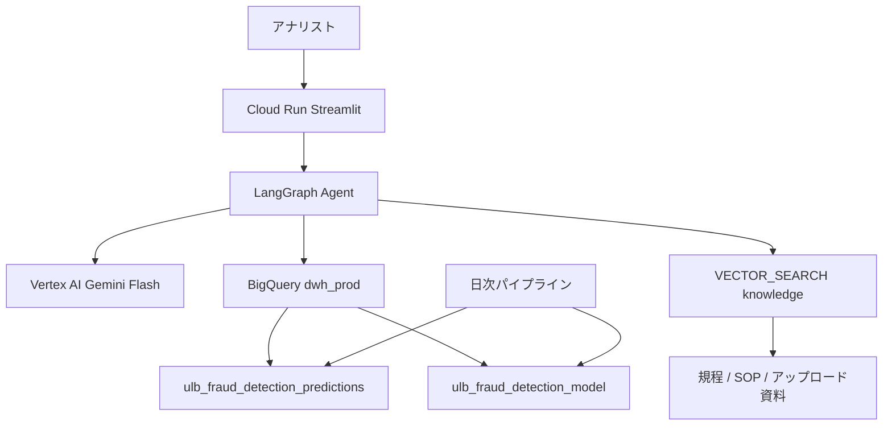

# credit_detect

クレジットカード不正監視データパイプラインと、その推論結果を調査する **Autonomous Fraud Investigation Agent（PoC）** です。

- パイプライン（守り）: Dataform × BQML × Cloud Workflows × Terraform
- エージェント（攻め）: LangGraph × Vertex AI × BigQuery Vector Search × Cloud Run
- エージェント仕様の詳細は **[Agent.md](Agent.md)**
- 評価指標の定義は **[EVALUATE.md](EVALUATE.md)**
- PoC の作業ブランチは **`agent/poc`**

# 1. プロジェクト概要

公開されているクレジットカード取引データセットを活用し、日次のデータ取り込みからデータ加工、機械学習モデルによる不正検知、そしてダッシュボードでの可視化までを一貫して行う自動化パイプラインを構築します。
実運用を想定し、インフラストラクチャはすべてTerraformを用いてコード化（IaC）しています。

その上に、日次推論で付いた異常スコアと自然言語の調査指示を入力に、SQL 生成・規程検索・統計・自己修正・是正 SQL 提案までを自律実行する Agent を PoC として載せます。

# 2. アーキテクチャ


## 構成図 (システムフロー)

1. **Cloud Scheduler** (日次トリガー)
↓
2. **Cloud Run Jobs** (擬似データをBigQueryにインサート)
↓
3. **Workflows** (後続の処理をオーケストレーション)
↓
4. **Dataform** (ETL処理・特徴量エンジニアリング) + **GitHub**連携
↓
5. **BigQuery ML** (機械学習モデルの再学習・推論)
↓
6. **Looker Studio** (ダッシュボード可視化)
↓
7. **Fraud Investigation Agent**（本 PoC）LangGraph が推論テーブルと規程 RAG を使って調査レポートを返す



## 各コンポーネントの役割と工夫点

- **疑似ストリーミング/バッチ処理 (Cloud Run Jobs)**
元の公開データは2日分のみの静的データですが、実運用に近づけるため、Cloud Run Jobsを用いて元データから擬似的に日次でデータを抽出し、分析用のBigQueryテーブルに追記する仕組みを実装します。これにより、日次バッチが「意味のあるデータ更新」として機能します。
- **Dataformによる特徴量エンジニアリング**
単なるデータコピーではなく、機械学習の精度を上げるためのデータ加工（取引金額の標準化、時間帯（秒）データのカテゴリ化、Null処理など）をDataform上のSQL（.sqlx）として実装し、GitHubでバージョン管理します。
- **Workflowsによる制御**
データ投入から、Dataformの実行、BQMLモデルの更新までの一連の流れを安全に連携させます。
- **調査 Agent**
推論確率 `fraud_probability` を自然言語から Text-to-SQL し、SOP の KS / Cliff's Delta で特徴量を評価して監査レポートを出します。詳細は [Agent.md](Agent.md)。

# 3. 使用するデータセットと機械学習モデル

## 使用データセット

- **対象データ:** `bigquery-public-data.ml_datasets.ulb_fraud_detection`
- **ターゲット変数:** `Class` (1: 不正利用、 0: 正常利用)

## データ分割戦略

- 疑似的にインサートされたデータを元に、直近N日分を「学習・検証用」、最新のバッチ取り込み分を「予測・評価用」としてパイプライン内で自動分割します。

## 機械学習モデル

- **アルゴリズム:** 勾配ブースティング木 (`boosted_tree_classifier`)
- 極端な不均衡データ（正常取引が圧倒的多数）であるため、決定木ベースのアンサンブル学習を採用し、パラメータチューニングによる精度向上を図ります。

# 4. ダッシュボード可視化項目 (Looker Studio)

ビジネス層が日々の状況を把握し、かつモデルの精度をモニタリングできるダッシュボードを構築します。

### **A. 運用指標 (最新バッチ結果)**

- クレジットカード総取引数
- 検知された不正利用数
- 不正利用の割合（％）

### **B. モデル評価指標 (不均衡データに特化)**

- **PR-AUC (適合率-再現率曲線の下部面積):** 不正検知において最も重視すべき指標。
- **F1スコア:** 適合率と再現率の調和平均。
- **再現率 (Recall):** 実際の不正のうち、どれだけ検知できたか（見逃しを防ぐ）。
- **適合率 (Precision):** 不正と予測したうち、実際に不正だった割合（誤報を防ぐ）。
- **ROC曲線 / AUC**

### **C. 追加評価指標 (SOP-MLOPS-2026-002)**

算出定義・判定基準・Looker Studio 用テーブルは [EVALUATE.md](EVALUATE.md) を参照。

**① 分布乖離・判別力 (Distribution Separation)**

- KS統計量 (Kolmogorov-Smirnov)
- IV (Information Value) / WoE
- Cliff's Delta (δ)
- 陽性・陰性 Zスコア差 (ΔZ)（参考値）

**② BQML 固有説明性 (Model Explainability)**

- `ML.FEATURE_IMPORTANCE` (Gain)
- `ML.FEATURE_IMPORTANCE` (Cover)
- `ML.GLOBAL_EXPLAIN` (Tree SHAP)
- `ML.EXPLAIN_PREDICT` (Local SHAP)

**③ 予測性能・不均衡適応 (Predictive Performance)**

- PR-AUC (Precision-Recall AUC)
- Top-K% Capture Rate (Recall)
- Cost-Sensitive Expected Loss

**④ 安定性・経時変化 (Model & Data Stability)**

- PSI (Population Stability Index)

# 5. インフラストラクチャとデプロイメント (IaC)

実務レベルのクラウド設計を証明するため、コンソールからの手動作成を廃し、以下のリソースをすべて **Terraform** で定義します。

- **BigQuery** データセット、テーブルスキーマ
- **Cloud Scheduler & Workflows** ジョブ定義とスケジューリング
- **Cloud Run Jobs** コンテナ実行環境の定義
- **Dataform** リポジトリ連携設定
- **IAM / サービスアカウント** 最小特権
- **Agent PoC（`terraform/agent.tf`）** Vertex AI API、ステージング GCS、ナレッジテーブル、調査用 SA、任意の Streamlit Cloud Run

リポジトリには `terraform apply` と初期データ投入を一括で行うシェルスクリプトを同梱し、第三者が容易に環境を再現できるようにします。

# 6. 注意事項 (データセット分割による擬似運用について)

本プロジェクトで使用する公開データセット（`ulb_fraud_detection`）は、元々「2日間（48時間）の取引データ」しか含まれていない静的なデータセットです。これを日次運用される実際のデータパイプラインとして機能させるため、本プロジェクトでは意図的に以下の工夫を行っています。

### **レコードスライスによるデータ分割**

元データを50分割し、「50日分のバッチデータ」と見立てて抽出し、50日分の擬似的な日次データとして処理します。

# 7. 事前準備（日次パイプライン）

## Artifact RegistryにCloud Run Jobsのファイル一式を登録する

```bash
# 1. 必要なAPIを有効化する
gcloud services enable artifactregistry.googleapis.com cloudbuild.googleapis.com

# 2. Docker用のリポジトリ（my-repo とする）を作成する
gcloud artifacts repositories create my-repo \
    --repository-format=docker \
    --location=asia-northeast1 \
    --description="Repository for fraud detection pipeline"

# 3. ビルド＆プッシュの実行（リポジトリルートで）
gcloud builds submit ./batch_app \
    --tag asia-northeast1-docker.pkg.dev/YOUR_PROJECT/my-repo/daily-ingest:latest
```

## Terraform 変数

`terraform/example.tfvars` をコピーして `terraform/terraform.tfvars` を作り、`project_id` を設定します。

```hcl
project_id = "your-gcp-project-id"
region     = "asia-northeast1"
repo_docker = "my-repo"
```

## Dataformにgithubの情報を登録する

`dataform_git_url` と Secret Manager 上の GitHub PAT（`dataform_github_token_secret`）を Terraform 変数で渡します。

---

# 8. Autonomous Fraud Investigation Agent の GCP 構築

本節だけ読めば、既存の `dwh_prod` 推論テーブルの上に調査 Agent を東京リージョンへ出せます。仕様の詳細は [Agent.md](Agent.md) です。

PoC では **2 つのデプロイ経路** を用意しています。

| 経路 | 使いどころ | エージェントの実行場所 |
| --- | --- | --- |
| **A. Cloud Run 同梱（推奨）** | 最短で画面まで出す | Streamlit コンテナ内の LangGraph |
| **B. Vertex AI Agent Engine** | 設計メモどおりのマネージド実行 | Reasoning Engine。UI は Cloud Run |

どちらも BigQuery と Gemini は `asia-northeast1`、ナレッジは `dwh_prod.fraud_investigation_knowledge` です。

## 8.1 前提条件

1. 日次パイプラインが一度以上成功し、次が存在すること。
   - `{PROJECT}.dwh_prod.ulb_fraud_detection_model`
   - `{PROJECT}.dwh_prod.ulb_fraud_detection_predictions`
2. 操作する Google アカウントに、対象プロジェクトの Owner または次相当があること。
   - `roles/aiplatform.admin` または `roles/aiplatform.user`
   - `roles/bigquery.admin` または jobUser + データセット編集
   - `roles/run.admin`, `roles/storage.admin`, `roles/iam.serviceAccountUser`
   - Terraform 用の `roles/resourcemanager.projectIamAdmin`（既存 SA への IAM 追加）
3. 課金アカウントがリンクされていること。Vertex AI と BigQuery は従量です。
4. ローカルに `gcloud`、`terraform` >= 1.5、Python 3.11、Docker または Cloud Build。

パイプライン未構築の場合は、先に第7節と `terraform apply`（`enable_agent_cloud_run=false` のまま）でデータセットと Workflows を作り、Dataform の `initial_setup` と `daily_batch` を実行してください。Agent は推論テーブルが空でも mock では動けますが、本番相当の調査には予測行が必要です。

## 8.2 プロジェクトと認証

```bash
export PROJECT_ID="your-gcp-project-id"
export REGION="asia-northeast1"
export DATASET_ID="dwh_prod"

gcloud auth login
gcloud auth application-default login
gcloud config set project "${PROJECT_ID}"
gcloud config set billing/quota_project "${PROJECT_ID}"
```

Application Default Credentials が Vertex / BigQuery の両方で使われます。組織ポリシーで `iam.disableServiceAccountKeyCreation` が有効でも、ADC と Cloud Run の実行 SA だけで完結する想定です（キーは作りません）。

## 8.3 有効化する API

Terraform（`terraform/main.tf` と `terraform/agent.tf`）が主に有効化します。手動で先に通す場合:

```bash
gcloud services enable \
  aiplatform.googleapis.com \
  bigquery.googleapis.com \
  storage.googleapis.com \
  run.googleapis.com \
  artifactregistry.googleapis.com \
  cloudbuild.googleapis.com \
  iam.googleapis.com \
  cloudresourcemanager.googleapis.com
```

初回の `aiplatform.googleapis.com` は数分かかることがあります。Agent Engine 用の Google 管理 SA `service-{PROJECT_NUMBER}@gcp-sa-aiplatform-re.iam.gserviceaccount.com` は API 有効化後に自動作成されます。Terraform がその SA へ BQ / GCS 権限を付けます。

## 8.4 Terraform で基盤を作る

```bash
cd terraform
cp example.tfvars terraform.tfvars
# terraform.tfvars を編集:
#   project_id                 = "your-gcp-project-id"
#   enable_agent               = true
#   enable_agent_cloud_run     = false   # イメージ未pushのうちは false
#   agent_ui_unauthenticated   = false

terraform init
terraform plan
terraform apply
```

作成される Agent 関連リソース:

| リソース | 名前 / ID | 役割 |
| --- | --- | --- |
| GCS | `{project_id}-fraud-agent-staging` | Agent Engine のパッケージステージング |
| SA | `sa-fraud-agent` | Cloud Run UI と Vertex 呼出し |
| BQ テーブル | `dwh_prod.fraud_investigation_knowledge` | 規程の本文と 768 次元 embedding |
| IAM | Agent Engine 管理 SA への jobUser / dataEditor / objectAdmin | マネージド実行から BQ と GCS を触るため |

適用後に出力を控えます。

```bash
terraform output agent_staging_bucket
terraform output agent_runtime_sa
terraform output knowledge_table
```

ステージングバケット URL は次の形です。

```text
gs://YOUR_PROJECT_ID-fraud-agent-staging
```

## 8.5 ナレッジ（規程）の初期投入とベクトル化

設計どおり、調査マニュアルは初期状態では未整備です。リポジトリの `knowledge/` に SOP 要約・社内規程ドラフト・カードテスト観点・エスカレーション手順を入れてあるので、それを BigQuery に埋め込みます。

```bash
cd /path/to/credit_detect
python3 -m venv .venv
source .venv/bin/activate
pip install -r agent/requirements.txt

export PROJECT_ID="your-gcp-project-id"
export LOCATION="asia-northeast1"
export DATASET_ID="dwh_prod"

# チャンク内容の確認（GCP 不要）
python scripts/seed_knowledge.py --dry-run

# 本番: text-embedding-004 でベクトル化し、knowledge テーブルへ UPSERT
python scripts/seed_knowledge.py \
  --project-id "${PROJECT_ID}" \
  --source-dir knowledge
```

追加のマニュアル（例: 正式版の評価手順）も同じテーブルに載せられます。

```bash
python scripts/seed_knowledge.py \
  --project-id "${PROJECT_ID}" \
  --file EVALUATE.md
```

行数が少ないと `CREATE VECTOR INDEX` は失敗することがあります。スクリプトは警告だけ出して続行します。数十件規模ではインデックス無しの `VECTOR_SEARCH` で十分です。

投入確認:

```bash
bq query --use_legacy_sql=false --location="${REGION}" "
SELECT category, COUNT(*) AS n
FROM \`${PROJECT_ID}.${DATASET_ID}.fraud_investigation_knowledge\`
GROUP BY category
"
```

## 8.6 ローカル動作確認（必須）

GCP を使う前に、グラフが mock で閉じることを確認します。

```bash
export PYTHONPATH="$(pwd):$(pwd)/evaluate"
python -m unittest discover -s agent/tests -v
python -m unittest discover -s evaluate -v

export AGENT_BACKEND=mock
python scripts/local_query.py --backend mock \
  --query "不正確率0.85以上かつAmount200ドル以上を調査し遮断SQLを提案して"
```

JSON に `final_report`・`generated_sql`・`statistical_summary.strong_separators` が入れば成功です。

ADC が通って推論テーブルがある場合は local モードで実データを読めます。

```bash
export AGENT_BACKEND=local
export PROJECT_ID="your-gcp-project-id"
python scripts/local_query.py --backend local
```

権限エラーのときは、自分のユーザーに `bigquery.jobUser` とデータセット閲覧、および `aiplatform.user` があるか確認してください。サービスアカウントで動かす場合は `sa-fraud-agent` を impersonate します。

```bash
gcloud iam service-accounts add-iam-policy-binding \
  sa-fraud-agent@${PROJECT_ID}.iam.gserviceaccount.com \
  --member="user:YOU@example.com" \
  --role="roles/iam.serviceAccountTokenCreator"

gcloud auth application-default login --impersonate-service-account \
  sa-fraud-agent@${PROJECT_ID}.iam.gserviceaccount.com
```

## 8.7 経路 A: Cloud Run に UI + LangGraph を載せる（推奨 PoC）

Agent Engine を待たずに、アナリスト向け画面とエージェント実行を同じサービスにまとめます。コールドスタートはありますが、`min_instances = 0` のためアイドル課金はほぼゼロです。

### 8.7.1 コンテナを Artifact Registry へ

第7節で `my-repo` が無い場合は先に作成します。**ビルドコンテキストはリポジトリルート**です（`agent/` `evaluate/` `knowledge/` `app/` を同梱するため）。設定ファイルは `cloudbuild.agent.yaml` です。

```bash
gcloud artifacts repositories create my-repo \
    --repository-format=docker \
    --location="${REGION}" \
    --description="credit_detect images" \
  || true

gcloud builds submit . --config=cloudbuild.agent.yaml \
  --substitutions=_IMAGE="${REGION}-docker.pkg.dev/${PROJECT_ID}/my-repo/fraud-agent-ui:latest"
```

ローカル Docker を使う場合:

```bash
gcloud auth configure-docker "${REGION}-docker.pkg.dev"
docker build -f app/Dockerfile \
  -t "${REGION}-docker.pkg.dev/${PROJECT_ID}/my-repo/fraud-agent-ui:latest" .
docker push "${REGION}-docker.pkg.dev/${PROJECT_ID}/my-repo/fraud-agent-ui:latest"
```

### 8.7.2 Cloud Run サービスを Terraform または gcloud で公開

イメージが registry に載ってから:

```hcl
# terraform.tfvars
enable_agent_cloud_run   = true
agent_ui_unauthenticated = false
```

```bash
cd terraform && terraform apply
terraform output agent_ui_uri
```

または gcloud（Terraform の SA を実行ユーザーにする）:

```bash
gcloud run deploy fraud-agent-ui \
  --image="${REGION}-docker.pkg.dev/${PROJECT_ID}/my-repo/fraud-agent-ui:latest" \
  --region="${REGION}" \
  --service-account="sa-fraud-agent@${PROJECT_ID}.iam.gserviceaccount.com" \
  --cpu=1 --memory=1Gi --timeout=300 \
  --min-instances=0 --max-instances=2 \
  --set-env-vars="PROJECT_ID=${PROJECT_ID},LOCATION=${REGION},DATASET_ID=${DATASET_ID},AGENT_BACKEND=local,MODEL_NAME=gemini-2.0-flash" \
  --no-allow-unauthenticated
```

自分のアカウントに実行権限を付けます。

```bash
gcloud run services add-iam-policy-binding fraud-agent-ui \
  --region="${REGION}" \
  --member="user:YOU@example.com" \
  --role="roles/run.invoker"

gcloud run services proxy fraud-agent-ui --region="${REGION}" --port=8080
```

デモで一時的に公開する場合のみ（データが公開データ由来でも、生成 SQL と規程が外に出ます）:

```bash
gcloud run services add-iam-policy-binding fraud-agent-ui \
  --region="${REGION}" \
  --member="allUsers" \
  --role="roles/run.invoker"
```

### 8.7.3 画面での確認手順

1. サイドバー **バックエンド** を `local`（Cloud Run 既定）または手元なら `mock`
2. Project ID / Location / Dataset が `dwh_prod` になっていること
3. 既定の調査文のまま「自律調査を開始」
4. 「調査レポート」にエグゼクティブサマリーが出ること
5. 「実行プロセス」に Plan、`fraud_probability` を含む SELECT、統計の `strong_separators`
6. 「即時是正SQL」が `SELECT` であり `DELETE` でないこと
7. 任意: `knowledge/` 以外の `.md` をアップロードし「ベクトル化して登録」後、もう一度調査して「参照規程」に新しい title が出ること

## 8.8 経路 B: Vertex AI Agent Engine（Reasoning Engine）

Cloud Run を UI 専用にし、グラフをマネージド実行する場合です。ステージングバケットと `sa-fraud-agent` の権限は 8.4 で済んでいます。

```bash
source .venv/bin/activate
export PROJECT_ID="your-gcp-project-id"
export LOCATION="asia-northeast1"
export STAGING_BUCKET="gs://${PROJECT_ID}-fraud-agent-staging"
export MODEL_NAME="gemini-2.0-flash"

python scripts/deploy_reasoning_engine.py \
  --project-id "${PROJECT_ID}" \
  --location "${LOCATION}" \
  --staging-bucket "${STAGING_BUCKET}" \
  --model-name "${MODEL_NAME}"
```

成功すると次のようなリソース名が印字されます。

```text
projects/PROJECT_NUMBER/locations/asia-northeast1/reasoningEngines/RESOURCE_ID
```

コンソール確認: Vertex AI → Agent Engine（または Reasoning Engine）→ `fraud-investigation-agent`。

Cloud Run から呼ぶ場合は環境変数を足してリビジョンを出します。

```bash
gcloud run services update fraud-agent-ui \
  --region="${REGION}" \
  --set-env-vars="AGENT_BACKEND=reasoning_engine,REASONING_ENGINE_RESOURCE_NAME=projects/.../reasoningEngines/..."
```

UI サイドバーのバックエンドを `reasoning_engine` にし、同じリソース名を貼って調査を実行します。

`agent_engines.create` がリージョンや SDK 差で失敗する場合、スクリプトは `vertexai.preview.reasoning_engines.ReasoningEngine.create` にフォールバックします。それでも失敗するときは経路 A を正とし、Issue に SDK バージョンとエラー全文を残してください。

必要な IAM（Terraform 済みの再掲）:

- デプロイするユーザー: `roles/aiplatform.admin`, ステージングバケットへの objectAdmin
- `service-{NUMBER}@gcp-sa-aiplatform-re.iam.gserviceaccount.com`: `roles/aiplatform.user`, `roles/bigquery.jobUser`, データセット `dataEditor`, ステージング objectAdmin
- Cloud Run SA `sa-fraud-agent`: `roles/aiplatform.user`（リモート query 用）

## 8.9 Gemini モデル名

設計メモはコスト優先で `gemini-1.5-flash-002` です。2026-09 時点の東京リージョンでは `gemini-2.0-flash` を既定にしています。

```bash
gcloud alpha ai models list --region="${REGION}" | grep -i gemini
```

使える Flash 系があれば `MODEL_NAME` と Cloud Run の env を合わせてください。Pro は PoC 予算（月 2 万円）を圧迫しやすいので使わないでください。

## 8.10 コスト監視（FinOps）

1. Billing → 予算 → 月 20,000 JPY、80% でメール
2. 対象サービス: Vertex AI, BigQuery, Cloud Run, Cloud Storage
3. エージェントは SELECT に 10GiB billed キャップ、結果 200 行
4. ナレッジ再埋め込みは差分 UPSERT だが、全文書を頻繁にやり直すと Embedding API が嵩む
5. Cloud Run `min_instances=0`、Agent Engine もリクエスト課金。検証後はサービスを止める（8.12）

## 8.11 よくある失敗

| 症状 | 対処 |
| --- | --- |
| `404` Gemini | `LOCATION` とモデルのリージョン対応を確認。`us-central1` へだけ逃がすのは最終手段（BQ は東京のままクロスリージョン課金） |
| `Access Denied` VECTOR_SEARCH | `sa-fraud-agent` にデータセット dataEditor / Viewer。テーブルが terraform で出来ているか |
| `maximumBytesBilled exceeded` | 生成 SQL が公開全表スキャン。プロンプトは `predictions` を優先。必要ならテーブルを `Date` で絞る |
| SQL が `predicted_Class_probs` を参照 | 推論テーブルにその列は無い。`fraud_probability` を使う。Reflection が再生成する |
| Cloud Run タイムアウト | `--timeout=300`。それでも足りなければ調査 SQL を狭める |
| Agent Engine の import エラー | `extra_packages` に `agent` と `evaluate`。経路 A で切り分け |
| ベクトルインデックス作成失敗 | 行数不足。無視してよい |

## 8.12 破棄

```bash
# Cloud Run UI
gcloud run services delete fraud-agent-ui --region="${REGION}" --quiet

# Agent Engine（リソース名はデプロイ時の出力）
gcloud ai reasoning-engines delete RESOURCE_ID --region="${REGION}" --quiet \
  || echo "コンソールの Vertex AI > Agent Engine から削除"

cd terraform
terraform apply -var="enable_agent=false" -var="enable_agent_cloud_run=false"
# または Agent ごとプロジェクトを検証用にしている場合
# terraform destroy
```

ナレッジテーブルだけ消す場合:

```bash
bq rm -f -t "${PROJECT_ID}:${DATASET_ID}.fraud_investigation_knowledge"
```

日次パイプライン（Scheduler / Workflows / モデル）は Agent 破棄後も残します。

---

# 9. 開発者向けクイックスタート（画面のみ）

```bash
pip install -r app/requirements.txt
export PYTHONPATH="$(pwd):$(pwd)/evaluate"
export AGENT_BACKEND=mock
streamlit run app/app.py --server.port=8080
```

ブラウザで `http://localhost:8080` を開き、第 8.7.3 節と同じ操作をします。
